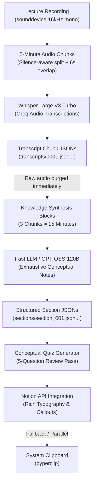

# Notes-Automation

A Python CLI application that records long lectures (2–8+ hours), transcribes them using Groq Whisper Turbo, synthesizes exhaustive conceptual study notes using Fast LLMs (`openai/gpt-oss-120b`), generates review quizzes, and saves everything to Notion with native rich typography.

> **Project Status**: Currently in active development — not yet production ready, but it will be soon!

---

## Target Architecture



---

## Key Features

- **Interactive Lecture Naming**: Prompts for a lecture title automatically upon starting `./lec start` (or `./lec transcribe-only`), or accepts `--name "Title"` on the command line.
- **Strict Decoupling**: 5-minute audio chunks (`AUDIO_CHUNK_MINUTES=5`) for Whisper vs 15-minute knowledge synthesis blocks (`LLM_CHUNKS_PER_BLOCK=3`).
- **Zero Local Footprint & Clean Storage**: Raw audio files are purged from disk immediately after transcription is cached in JSON, and temporary session state is cleaned up upon pipeline completion. No Markdown files are saved locally to disk.
- **Full Resumability (`./lec resume`)**: Granular JSON caching (`transcripts/` and `sections/`) with `state.json` lifecycle tracking. If interrupted, the pipeline continues from the last completed chunk or section without repeating completed work.
- **Compact Context Carry-Over**: Tracks topics, key terminology, and continuations across blocks without token bloat on long multi-hour lectures.
- **Proactive Quota Management**: Inspects live Groq headers and proactively pauses before hitting RPM/TPM limits, with automated fallback model escalation.
- **Exhaustive Conceptual Notes**: Strictly prohibits high-level summaries. Preserves every definition, derivation, mechanism, numerical example, code snippet, and student Q&A.
- **Aesthetic Notion Formatting**: Zero raw asterisks, structured callouts (Notes, Warnings, Key Takeaways, Priority, Q&A), 2D tables, rotating section color palettes (blue → purple → green), and custom icons.
- **Single Final-Pass Quiz**: Generates 5 high-quality conceptual review MCQs once at the end of the lecture with answer keys and grounded explanations.
- **Clipboard Fallback**: Notes are automatically copied directly to the system clipboard upon completion or when running with `--clipboard`.

---

## Quick Start

### 1. Prerequisites
- Python 3.10+
- `ffmpeg` and `ffprobe` installed on your system (`brew install ffmpeg` on macOS)

### 2. Installation
```bash
git clone https://github.com/your-username/Notes-Automation.git
cd Notes-Automation
python3 -m venv venv
source venv/bin/activate
pip install -r requirements.txt
cp .env.example .env
```

### 3. Configuration (`.env`)
Create and edit `.env`:
```env
# Required Credentials
GROQ_API_KEY=gsk_your_groq_api_key_here
NOTION_TOKEN=ntn_your_notion_integration_token_here
NOTION_PAGE_ID=your_32_char_notion_parent_page_id_here

# Model Selection (Defaults)
GROQ_WHISPER_MODEL=whisper-large-v3-turbo
GROQ_NOTE_MODEL=openai/gpt-oss-120b
GROQ_QUIZ_MODEL=openai/gpt-oss-120b
GROQ_TEMPERATURE=0.2

# Decoupled Chunking Architecture
AUDIO_CHUNK_MINUTES=5
LLM_CHUNKS_PER_BLOCK=3

# Resilience & Retries
MAX_RETRIES=5
AUTOSAVE_INTERVAL_SECONDS=300
```

> **Setting up Notion**:
> 1. Create an Internal Integration at [notion.so/my-integrations](https://www.notion.so/my-integrations) and copy the integration secret (`NOTION_TOKEN`).
> 2. Open your parent Notion page, click the top right `...` → **Connections** → **Connect to** → select your integration.
> 3. Copy the 32-character Page ID from the URL into `NOTION_PAGE_ID`.

---

## CLI Usage

All commands can be executed via the `./lec` script or directly with `python3 main.py`.

### 1. Live Recording & Automatic Note Generation
```bash
# Start recording (prompts interactively for lecture name)
./lec start

# Or supply the lecture title directly
./lec start --name "Operating Systems - Virtual Memory"

# Save only to clipboard (skips Notion upload)
./lec start --clipboard

# Keep audio file locally after completion (optional)
./lec start --keep-audio
```
*Press `Ctrl+C` in the recording terminal to stop recording and trigger the automated pipeline.*

### 2. Stop Recording Safely (from another terminal)
```bash
./lec stop
```

### 3. Resume Interrupted Sessions
```bash
# Automatically resumes from the last completed chunk or section
./lec resume
```

### 4. Transcribe-Only Mode
```bash
# Record and cache transcripts to disk without generating notes yet
./lec transcribe-only

# Or transcribe an existing audio file
./lec transcribe-only --audio path/to/lecture.wav
```

### 5. Generate-Only Mode
```bash
# Synthesize notes and quiz from cached transcript chunks
./lec generate-only

# Or point to a specific session directory
./lec generate-only --session-dir /tmp/notes_sessions/session_xyz
```

### 6. Quota & Feasibility Estimator
```bash
# Analyze Groq quota and token feasibility for a planned lecture duration
./lec estimate --hours 4.5
./lec estimate --minutes 90
```

---

## Project Structure

```text
Notes-Automation/
├── main.py               # CLI entrypoint & subcommands (start, stop, resume, estimate, etc.)
├── lec                   # Executable wrapper script
├── recorder.py           # Audio capture with background thread & rolling autosave
├── audio_splitter.py     # Silence-aware pause detection and ffmpeg boundary planning
├── transcriber.py        # Groq Whisper Turbo transcription pipeline & JSON chunk caching
├── transcript_store.py   # Per-chunk transcript storage & retrieval (0001.json, 0002.json)
├── note_generator.py     # Fast LLM synthesis & anti-summarization prompt engine
├── section_store.py      # Granular section storage & multi-block markdown reconstruction
├── quiz_generator.py     # Single-pass 5-question conceptual MCQ generator & Notion appender
├── context_manager.py    # Rolling context carry-over (topics, terminology, heading colors)
├── quota_manager.py      # Proactive rate-limit tracking, header inspection, backoff retries
├── estimator.py          # Pre-flight quota calculation and feasibility dashboard
├── notion_saver.py       # Rich Notion API block builder (callouts, tables, code, color rotation)
├── clipboard_saver.py    # System clipboard fallback (pyperclip)
├── session_manager.py    # Ephemeral session lifecycle, state.json tracking, and cleanup
├── requirements.txt      # Python dependencies
└── .env.example          # Environment configuration template
```

---

## Resilience & Safety Guarantees

- **Crash Safety**: In-memory audio frames are written to a rolling autosave buffer every 5 minutes.
- **Proactive Pacing**: Pauses automatically before hitting Groq rate limits, eliminating 429 failures.
- **Zero Lost Work**: Each 5-minute transcript chunk and 15-minute section is saved immediately to JSON. Resuming an interrupted run never repeats completed API calls.
- **Notion Batching**: Blocks are uploaded in batches of 80 with per-block fallback to guarantee upload success within Notion API limits.

---

## Authors

Created by **Daksh Srivastav** and **Prathamesh More**.
