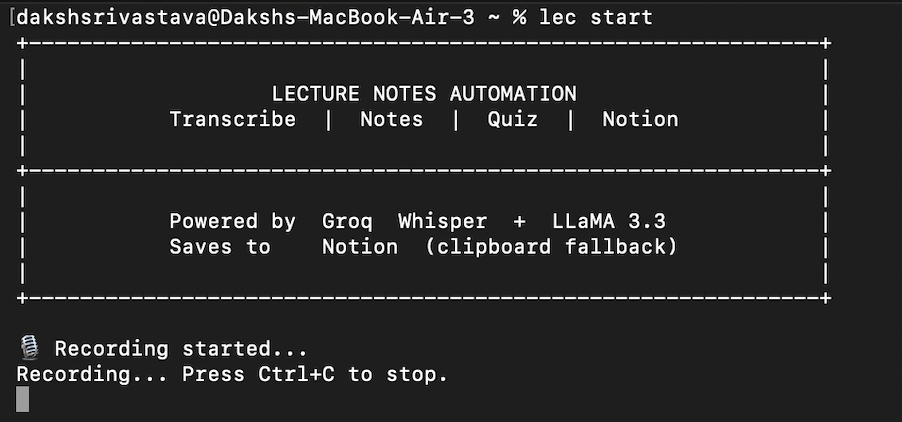
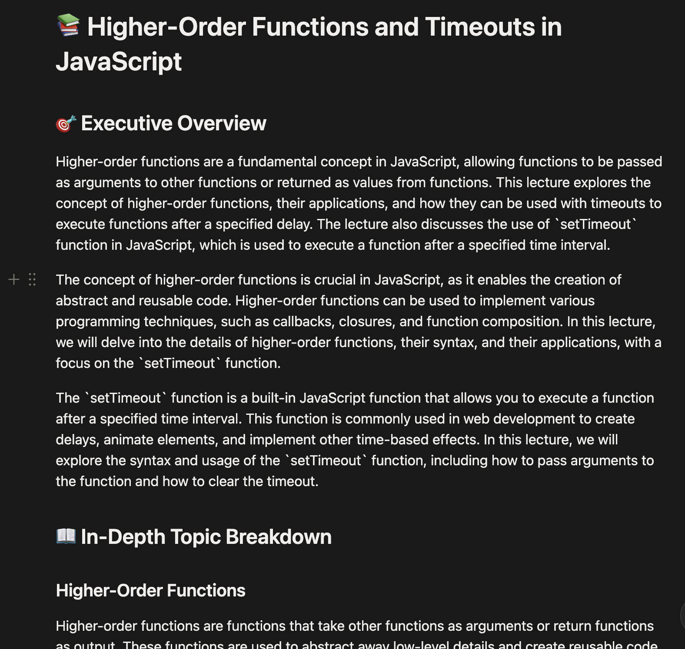
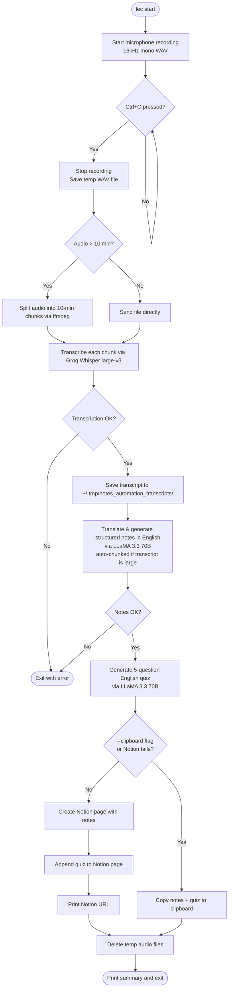

# Lecture Notes Automation

A command-line tool that records a lecture, transcribes it using Groq Whisper (with automatic `ffmpeg` audio chunking for long lectures), generates structured pure-English notes and a multiple-choice quiz using LLaMA 3.3, and saves everything to Notion. Transcripts are saved locally so you can re-generate notes at any time. If Notion is unavailable, output is copied to your clipboard automatically.

---

## Screenshots

### Terminal — recording a lecture



### Notion — generated notes



---

## Table of Contents

- [How It Works](#how-it-works)
- [Project Structure](#project-structure)
- [Prerequisites](#prerequisites)
- [Setup](#setup)
- [Configuration](#configuration)
- [Usage](#usage)
- [Pipeline Detail](#pipeline-detail)
- [Output Format](#output-format)
- [Error Handling and Fallbacks](#error-handling-and-fallbacks)
- [Key Features & Recent Improvements](#key-features--recent-improvements)

---

## How It Works



---

## Project Structure

```
Notes Automation/
├── main.py               CLI entry point, orchestration
├── recorder.py           Microphone recording via sounddevice
├── transcriber.py        Audio-to-text via Groq Whisper (with ffmpeg chunking)
├── note_generator.py     Structured English notes via Groq LLaMA 3.3 (with transcript chunking)
├── quiz_generator.py     MCQ quiz via Groq LLaMA 3.3
├── notion_saver.py       Notion page creation and Markdown conversion
├── clipboard_saver.py    Clipboard fallback via pyperclip
├── assets/               Screenshots used in this README
├── requirements.txt      Python dependencies
├── .env                  Your API keys (not committed)
├── .env.example          Template for .env
└── .gitignore            Git exclusion rules
```

---

## Prerequisites

- Python 3.11 or later
- `ffmpeg` installed on your system:
  - **macOS**: `brew install ffmpeg`
  - **Ubuntu/Debian**: `sudo apt install ffmpeg`
- A microphone connected to your machine
- A Groq account with an API key: https://console.groq.com
- A Notion account with an integration token and a target page ID

---

## Setup

### 1. Enter the project directory

```bash
cd "Notes Automation"
```

### 2. Create a virtual environment

```bash
python3 -m venv venv
source venv/bin/activate
```

### 3. Install dependencies

```bash
pip install -r requirements.txt
```

### 4. Configure your environment

```bash
cp .env.example .env
```

Open `.env` and fill in your keys:

```env
GROQ_API_KEY=gsk_...
NOTION_TOKEN=ntn_...
NOTION_PAGE_ID=3bc01971283e8043a6d4d1c84b35bd2e
```

### 5. (Optional) Create a `lec` alias

Add this to your `~/.zshrc` or `~/.bashrc` so you can run `lec` from anywhere:

```bash
alias lec='cd "/path/to/Notes Automation" && source venv/bin/activate && python main.py'
```

Then reload your shell: `source ~/.zshrc`

---

## Configuration

### GROQ_API_KEY

1. Sign in at https://console.groq.com
2. Go to API Keys and create a new key.
3. Copy the value starting with `gsk_`.

### NOTION_TOKEN

1. Go to https://www.notion.so/my-integrations
2. Click **"New integration"**, set connection type to **Access token**, select your workspace, and click **Create connection**.
3. Copy the **Internal Integration Secret** starting with `ntn_`.
4. **Grant Access**: Open the target Notion page → click **`...`** (top right) → **Connections** → **Connect to** → select your integration name.

### NOTION_PAGE_ID

The page ID is the 32-character string in your Notion page URL:

```
https://www.notion.so/My-Notes-3bc01971283e8043a6d4d1c84b35bd2e
                                ^^^^^^^^^^^^^^^^^^^^^^^^^^^^^^^^
                                This is your NOTION_PAGE_ID
```

---

## Usage

Always activate the virtual environment first (or use the `lec` alias):

```bash
source venv/bin/activate
```

### Record a new lecture

```bash
lec start
```

Starts the microphone and blocks. Press `Ctrl+C` when done. Automatically transcribes, generates notes + quiz, saves to Notion, and cleans up the audio file. The transcript is saved for later use.

### Re-generate notes from a past transcript

```bash
lec retry
```

Shows a numbered list of your last 10 saved transcripts with timestamps and a preview of the first line. Type a number to pick one — it re-generates notes and saves to Notion without re-recording.

```
Saved transcripts:

  [1] 14 Aug 2026  14:32:11  (87420 chars)  —  So today we're covering higher-order functions...
  [2] 14 Aug 2026  13:12:44  (54103 chars)  —  Welcome, today we look at the JVM execution model...
  [3] 14 Aug 2026  11:22:30  (38970 chars)  —  Alright let's continue with SQL joins and indexes...

Pick a transcript [1-3]:
```

### Process an existing audio file

```bash
lec process /path/to/lecture.wav
```

Runs the full pipeline (transcribe → notes → quiz → Notion) on any audio file on disk. Useful if you recorded with another app or the pipeline failed mid-way.

### Stop a recording started in another terminal

```bash
lec stop
```

### Force clipboard output (skip Notion entirely)

```bash
lec retry --clipboard
lec process /path/to/file.wav --clipboard
lec stop --clipboard
```

---

## Pipeline Detail

| Step                   | Module             | Service                        |
|------------------------|--------------------|--------------------------------|
| Transcribe audio       | transcriber.py     | Groq Whisper large-v3 (ffmpeg) |
| Save transcript        | main.py            | Local filesystem               |
| Generate notes         | note_generator.py  | Groq — llama-3.3-70b-versatile |
| Generate quiz          | quiz_generator.py  | Groq — llama-3.3-70b-versatile |
| Save notes to Notion   | notion_saver.py    | Notion API                     |
| Append quiz to Notion  | quiz_generator.py  | Notion API                     |
| Clipboard fallback     | clipboard_saver.py | pyperclip (local)              |
| Delete temp audio      | main.py            | Local filesystem (cleanup)     |

**Audio chunking**: Audio is recorded at 16 kHz mono (int16 PCM). Files over 10 minutes are split into 10-minute WAV segments via `ffmpeg` before transcription, keeping each request under Groq's 25 MB limit. Audio is deleted after transcription.

**Transcript chunking**: If the transcript is too large for a single LLaMA request (Groq's 12,000 TPM limit), `note_generator.py` automatically splits it into ~28,000-char chunks, generates notes per chunk, and merges them. Includes exponential backoff (30s → 60s → 120s) on rate-limit errors.

**Long lectures**: A 3-hour lecture produces ~150,000 chars of transcript (~5–6 chunks). The full pipeline takes 20–40 minutes due to API rate limits. The tool handles it automatically.

---

## Output Format

### Notes (Markdown → Notion)

```markdown
# 📚 Title of the Lecture

## 🎯 Executive Overview
Detailed 2-3 paragraph overview of the lecture topic.

## 📖 In-Depth Topic Breakdown
### Concept One
Step-by-step explanation with code blocks, formulas, and diagrams.

## 🔑 Key Terms & Definitions
- **Term**: definition

## 💡 Practical Examples & Applications
Fully worked-out examples and real-world analogies.

## ⚠️ Common Pitfalls, Edge Cases & Exam Gotchas
Typical mistakes and tricky exam questions.

## 📝 Quick Revision Checklist
- 5–8 bullet point summary for pre-exam review
```

### Quiz (Markdown)

```markdown
**Q1. Question text here**
A) Option one
B) Option two
C) Option three
D) Option four

## Answer Key
Q1: C, Q2: A, Q3: B, Q4: D, Q5: C
```

---

## Error Handling and Fallbacks

| Failure                     | Behavior                                                      |
|-----------------------------|---------------------------------------------------------------|
| .env missing                | Exits with instructions before doing anything                 |
| Missing API keys            | Exits listing which variables are absent                      |
| Transcription fails         | Prints error, exits pipeline — no notes possible              |
| Groq TPM rate limit hit     | Waits 30s/60s/120s and retries automatically (up to 4 times)  |
| Note generation fails       | Prints error, exits pipeline                                  |
| Quiz generation fails       | Prints warning, continues without quiz                        |
| Notion page not found       | Prints connection instructions, falls back to clipboard       |
| Notion save fails           | Falls back to clipboard                                       |
| Clipboard fails             | Prints error; notes still saved to temp `.md` file            |
| Audio cleanup fails         | Prints warning, continues                                     |
| No saved transcripts        | `retry` prints a helpful message instead of crashing          |

---

## Key Features & Recent Improvements

- **Transcript History**: Every transcription is saved to disk (last 10 kept). Use `lec retry` to pick any past transcript and re-generate notes without re-recording.
- **Process Any Audio File**: `lec process <file>` runs the full pipeline on any existing audio file — no re-recording needed.
- **Automatic Transcript Chunking**: Transcripts too large for a single LLaMA request are split into chunks and processed sequentially, with exponential backoff on rate-limit errors.
- **Automatic Audio Chunking**: Handles lectures of any length by splitting large audio into 10-minute WAV segments via `ffmpeg`, bypassing Groq's 25 MB request limit.
- **Pure English Output**: Notes and quizzes are automatically translated and formatted in pure English, even if the lecture was in Hindi or Hinglish.
- **Python 3.13+ Compatibility**: Direct `ffmpeg` subprocess calls, no reliance on deprecated `pyaudioop` / `pydub`.
- **Zero Space Leakage**: Temp audio files and chunks are purged automatically after transcription.
- **Robust Notion Error Diagnostics**: Clear troubleshooting guidance if page permissions are not connected.

## Built by Daksh & Prathamesh.

