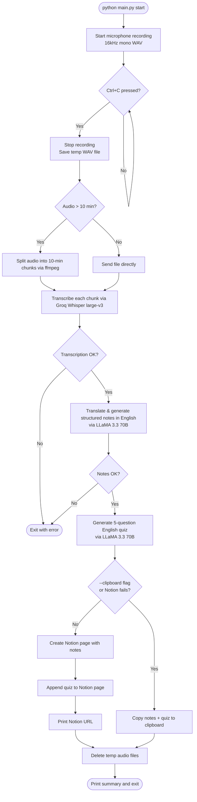

# Lecture Notes Automation

A command-line tool that records a lecture, transcribes it using Groq Whisper (with automatic `ffmpeg` audio chunking for long lectures), generates structured pure-English notes and a multiple-choice quiz using LLaMA 3.3, and saves everything to Notion. If Notion is unavailable, the output is copied to your clipboard automatically.

---

## Table of Contents

- [How It Works](#how-it-works)
- [Project Structure](#project-structure)
- [Prerequisites](#prerequisites)
- [Setup](#setup)
- [Configuration](#configuration)
- [Usage](#usage)
- [Pipeline Detail](#pipeline-detail)
- [Output Format](#output-format)
- [Error Handling and Fallbacks](#error-handling-and-fallbacks)
- [Key Features & Recent Improvements](#key-features--recent-improvements)

---

## How It Works



---

## Project Structure

```
Notes Automation/
├── main.py               CLI entry point, orchestration
├── recorder.py           Microphone recording via sounddevice
├── transcriber.py        Audio-to-text via Groq Whisper (with ffmpeg chunking)
├── note_generator.py     Structured English notes via Groq LLaMA 3.3
├── quiz_generator.py     MCQ quiz via Groq LLaMA 3.3
├── notion_saver.py       Notion page creation and Markdown conversion
├── clipboard_saver.py    Clipboard fallback via pyperclip
├── requirements.txt      Python dependencies
├── .env                  Your API keys (not committed)
├── .env.example          Template for .env
└── .gitignore            Git exclusion rules
```

---

## Prerequisites

- Python 3.11 or later
- `ffmpeg` installed on your system:
  - **macOS**: `brew install ffmpeg`
  - **Ubuntu/Debian**: `sudo apt install ffmpeg`
- A microphone connected to your machine
- A Groq account with an API key: https://console.groq.com
- A Notion account with an integration token and a target page ID

---

## Setup

### 1. Enter the project directory

```bash
cd "Notes Automation"
```

### 2. Create a virtual environment

```bash
python3 -m venv venv
source venv/bin/activate
```

### 3. Install dependencies

```bash
pip install -r requirements.txt
```

### 4. Configure your environment

```bash
cp .env.example .env
```

Open `.env` and fill in your keys:

```env
GROQ_API_KEY=gsk_...
NOTION_TOKEN=ntn_...
NOTION_PAGE_ID=3bc01971283e8043a6d4d1c84b35bd2e
```

---

## Configuration

### GROQ_API_KEY

1. Sign in at https://console.groq.com
2. Go to API Keys and create a new key.
3. Copy the value starting with `gsk_`.

### NOTION_TOKEN

1. Go to https://www.notion.so/my-integrations
2. Click **"New integration"**, set connection type to **Access token**, select your workspace, and click **Create connection**.
3. Copy the **Internal Integration Secret** starting with `ntn_`.
4. **Grant Access**: Open the target Notion page in your browser or desktop app $\rightarrow$ click the **`...`** (top right) $\rightarrow$ **Connections** $\rightarrow$ **Connect to** $\rightarrow$ select your integration name.

### NOTION_PAGE_ID

The page ID is the 32-character string in your Notion page URL:

```
https://www.notion.so/My-Notes-3bc01971283e8043a6d4d1c84b35bd2e
                                ^^^^^^^^^^^^^^^^^^^^^^^^^^^^^^^^
                                This is your NOTION_PAGE_ID
```

---

## Usage

Always activate the virtual environment first:

```bash
source venv/bin/activate
```

### Record a lecture (recommended workflow)

```bash
python3 main.py start
```

Starts the microphone and blocks. Press `Ctrl+C` when done. The tool automatically transcribes, generates notes and a quiz in English, saves to Notion, and cleans up temp files.

### Stop a recording started in another terminal

```bash
python3 main.py stop
```

### Force clipboard output (skip Notion entirely)

```bash
python3 main.py stop --clipboard
```

---

## Pipeline Detail

When stop is triggered (either via `Ctrl+C` from `start`, or by running `stop` directly), the following steps run in sequence:

| Step                   | Module            | Service                        |
|------------------------|-------------------|--------------------------------|
| Transcribe audio       | transcriber.py    | Groq Whisper large-v3 (ffmpeg) |
| Generate notes         | note_generator.py | Groq — llama-3.3-70b-versatile |
| Generate quiz          | quiz_generator.py | Groq — llama-3.3-70b-versatile |
| Save notes to Notion   | notion_saver.py   | Notion API                     |
| Append quiz to Notion  | quiz_generator.py | Notion API                     |
| Clipboard fallback     | clipboard_saver.py| pyperclip (local)              |
| Delete temp audio      | main.py           | local filesystem (cleanup)     |

Audio is recorded at 16 kHz mono (int16 PCM) into a WAV file in the system temp directory (`/tmp`). Long audio is automatically chunked into 10-minute WAV segments with `ffmpeg` before transcription, ensuring requests stay under Groq's 25 MB file limit. All audio files are deleted immediately after transcription completes.

---

## Output Format

### Notes (Markdown)

```markdown
# Title of the Lecture

## Summary
- Main point one
- Main point two

## Key Definitions
**Term**: definition of the term

## Examples
Example described or implied in the lecture
```

### Quiz (Markdown)

```markdown
**Q1. Question text here**
A) Option one
B) Option two
C) Option three
D) Option four

## Answer Key
Q1: C, Q2: A, Q3: B, Q4: D, Q5: C
```

---

## Error Handling and Fallbacks

| Failure                | Behavior                                                  |
|------------------------|-----------------------------------------------------------|
| .env missing           | Exits with instructions before doing anything             |
| Missing API keys       | Exits listing which variables are absent                  |
| Transcription fails    | Prints error, exits pipeline — no notes possible          |
| Note generation fails  | Prints error, exits pipeline                              |
| Quiz generation fails  | Prints warning, continues without quiz                    |
| Notion save fails      | Prints error with setup guide, falls back to clipboard    |
| Clipboard fails        | Prints error, notes still saved to temp .md file          |
| Audio cleanup fails    | Prints warning, continues                                 |

---

## Key Features & Recent Improvements

- **Automatic Audio Chunking**: Handles lectures of any length by splitting large audio files into 10-minute WAV segments via `ffmpeg`, bypassing Groq's 25 MB request entity limit.
- **Python 3.13+ Compatibility**: Direct `ffmpeg` subprocess calls without reliance on deprecated `pyaudioop` / `pydub`.
- **Pure English Output**: Notes and quizzes are automatically translated and formatted in pure English, even if the lecture was spoken in Hindi or Hinglish.
- **Zero Space Leakage**: All temporary recording files and audio chunks are purged automatically upon completion.
- **Robust Notion Error Diagnostics**: Clear troubleshooting guidance if page permissions are not connected.

## Built by Daksh & Prathamesh.
